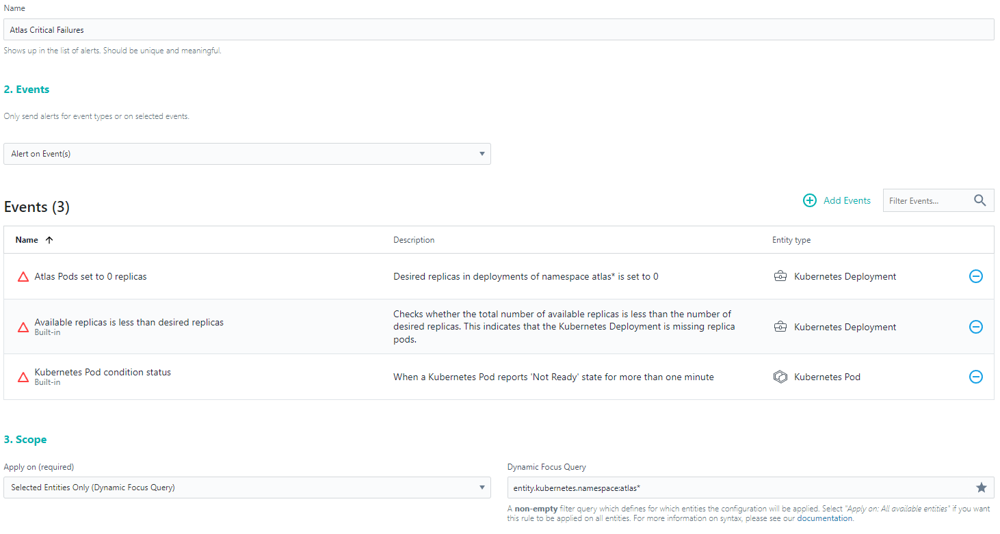

# Monitoring with Instana

General informations about instana are available here:\
https://confluence.sbb.ch/pages/viewpage.action?pageId=1450380751

## Implementation

### Backend Configuration

Add the following dependency to add [Micrometer](https://micrometer.io/).

```xml
<dependency>
   <groupId>io.micrometer</groupId>
   <artifactId>micrometer-tracing</artifactId>
</dependency>
<dependency>
   <groupId>io.micrometer</groupId>
   <artifactId>micrometer-tracing-bridge-brave</artifactId>
</dependency>
```

Edit your application.properties or yml and add `traceid=%X{traceId}` and `spanid=%X{spanId}` to it. E.g. it should look like
this:

```yaml
logging:
  pattern:
    console: timestamp=%d thread=%t loglevel=%-5p class=%c appname=atlas traceid=%X{traceId} spanid=%X{spanId} message="%m"%n
```

### Frontend Setup

Go to Instana Websites and add a new Website to track. You will be presented with a piece of javascript to include in your
application.

To support different instanakeys in various stages we modified the original script a little bit.

Add this to the `head` of your `index.html`:

```html
<!-- Instana Website Tracking -->
<script type="text/javascript" src="assets/monitoring/instana.js"></script>
<script defer crossorigin="anonymous" src="https://eum.instana.io/eum.min.js"></script>
```

The tracking script for Instana is located [here](../frontend/src/assets/monitoring/instana.js).
To include the environment variables correctly we have to configure the variable in `angular.json`:

```json
...
"ngsscbuild": {
  "builder": "angular-server-side-configuration:ngsscbuild",
  "options": {
    "additionalEnvironmentVariables": ["INSTANA_KEY"],
    "browserTarget": "atlas-frontend:build",
...
```

Finally pass `INSTANA_KEY` as environment variable in your helm charts.

## Using Instana

Instana Test is used for Test clusters (dev + test stages): https://sbb-sbbtest.instana.io.\
Instana Prod is used for Prod clusters (int + prod stages): https://sbb-sbb.instana.io.

### Websites & Mobile Apps

This view can be used to explore insight gathered on your configured frontend Websites. This includes page loads, load time as
well as HTTP request performed by the user.

### Applications

This view shows your application consisting of all your services in the configured namespace. You can take a look at latency,
processing times and much more.

### Kubernetes

Here you can explore settings and resources of your cluster and namespace.

### Alerts

Currently we set up an [alert](https://sbb-sbb.instana.io/#/config/team/alerting/alerts/yYqJcjocvPYUbHOO) to trigger on various
events.
This alert is triggered if the desired replicas are set to 0, available replicas is less than desired or pods report a state of '
not ready' for too long.



The alerts are configured to be reported in our Teams-Channel by using a webhook.

# Actuator

The [Spring Boot Actuator](https://docs.spring.io/spring-boot/docs/current/reference/html/actuator.html) is available
on `/actuator` and provides information about the running application.

To use Spring Actuator include the dependency to your project:

```xml
<dependency>
    <groupId>org.springframework.boot</groupId>
    <artifactId>spring-boot-starter-actuator</artifactId>
</dependency>
```

We configured it to show details on the health endpoint (e.g. for DB Health indication) and exposed all actuator endpoints.
This can be configured in the `application.yaml` or properties respectively

```yaml
management:
  endpoint:
    health:
      show-details: always
  endpoints:
    web:
      exposure:
        include: health, info, metrics
```