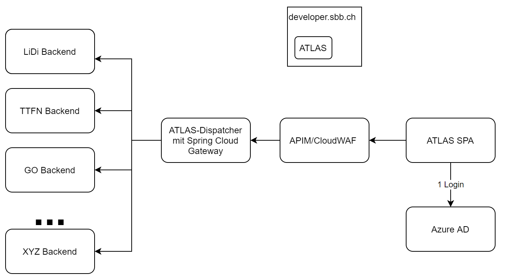

# Atlas - Security and API Infrastructure

Here we will explore topics regarding accessability to our API over the [SBB Developer Portal](https://developer.sbb.ch).
Further there are several steps necessary to secure our REST API using [RBT](https://rbt.sbb.ch/) Groups.

## API Management

Is responsible for registring and publishing APIs to the SBB Developer Portal. You can find the registration
repository [here](https://code.sbb.ch/projects/KI_ATLAS/repos/timetable-field-number-apim-configuration/browse).

The APIM Team further provides a deployable gateway including a CloudWAF. Documentation is
available [here](https://confluence.sbb.ch/display/AITG/52.+Gateway).

We will use the gateway to redirect to an internal gateway, which will redirect requests to the appropriate services.



## IAM

stands for Identity & Access Management.
Visit their [confluence](https://confluence.sbb.ch/display/IAM/IAM+Space+Home).

Atlas shall approve modifying requests with defined RBT Groups.

## Hands on

Now its time to get your hands dirty and set it up. Buckle up and stay with me...

### Deploy API

1. Include the roles you want to check in your resource server in the API Configuration

 ```yaml
"sso": {
  "client_roles": [
      "lidi-writer",
      "lidi-admin"
  ],
}
   ```

2. Build the configuration with Jenkins on your commit https://ci.sbb.ch/job/KI_ATLAS/job/atlas-apim-configuration/job/master/
3. Deployment of API Configuration can be done with esta-cloud-pipeline. Follow
   this [guide](https://confluence.sbb.ch/display/AITG/22.+Update+der+API+Konfiguration) to automate the process or deploy your
   configuration manually on [Integration](https://api-deploy.int.app.ose.sbb-aws.net/swagger-ui.html)
   or [Production](https://api-deploy.prod.app.ose.sbb-aws.net/swagger-ui.html). For Jenkins make sure to use `clientJenkinsId`
   and store the credentials on Jenkins (https://self.sbb-cloud.net/tools/jenkins).

### Register your client

1. Visit your API on the developer portal e.g. https://developer-int.sbb.ch/apis/atlas-dev/information
2. Signup with your desired plan
3. Choose the OAuth Flow "Authorization Code"
4. Remove all the redirect uris, we have to set them manually.

You can use this client to perform operations on the REST API from Postman and other.

### Manual interactions required for SPA and AD groups

Once the API client is created, we have to make some manual configuration updates, because APIM is not ready for the whole process
we need.

Visit IAM Swagger UI on [Integration](https://azure-ad-int.api.sbb.ch/swagger-ui/index.html?configUrl=/v3/api-docs/swagger-config)
or [Production](https://azure-ad.api.sbb.ch/swagger-ui/index.html?configUrl=/v3/api-docs/swagger-config)

You can export the configuration for your client as YAML, apply your changes and then upload it for an easy update.

1. Add and modify your redirectUris e.g. add paths to your SPA

```yaml
redirectUris:
- uri: https://developer-int.sbb.ch/oauth2-redirect.html
  type: WEB
- uri: http://localhost:4200
  type: SPA
- uri: https://atlas-frontend-dev.apps.aws01t.sbb-aws-test.net
  type: SPA
```

2. Note and remember the `clientId` of the `requiredPermissions`: This is the id for the app of the API itself (this should be
   validated requiring this id as audience on your backend).

Next step: look up the ID of the Azure AD group you want to assign to a role. Use the endpoint `/v1/groups` and look it up. E.g.
filter for `DG_RBT_LIDI_ADMIN_DEV`.
Remember this id as well

Now that we modified the redirectUris for our client, we will add AD groups to the AppRegistration of our API.
Download the yaml using the clientId. Update it so it will look like the following:

```yaml
roles:
- id: f425e724-8cdd-45fe-8531-ca495bfc34eb
  name: lidi-admin
  displayName: lidi-admin
  description: APIM generated role for the API timetable-field-number-dev on APIM-Stage int
  assignedToApps: []
  assignedToADGroups:
  # DG_RBT_LIDI_ADMIN_DEV
  - af9e31ad-e671-4ec5-9a42-0ad923efd65f
- id: dc6bdef4-d525-414f-a977-e86963ba4217
  name: lidi-writer
  displayName: lidi-writer
  description: APIM generated role for the API timetable-field-number-dev on APIM-Stage int
  assignedToApps: []
  assignedToADGroups:
  # DG_RBT_LIDI_WRITER_DEV
  - 6e24cad2-8196-4a73-8403-f488f99fc31b
- id: 57c6f090-8017-440e-a631-60a2d3a5058a
  name: apim-default-role
  displayName: apim-default-role
  description: APIM generated role for the API timetable-field-number-dev on APIM-Stage int
  assignedToApps: []
  assignedToADGroups:
  - 6a1d58ca-06bf-4503-9825-6f2934aed896
  - 8e180531-b0b5-4cb7-8825-b1f98d9a79f5
```

Apply the updated configurations.

### Setup your backend

1. Audience for your backend should correspond with the `clientId` of your API (where we added the roles)
2. Add role requirements to your security configuration

### Allow CORS Preflight request in CloudWAF Gateway

https://confluence.sbb.ch/display/AITG/56.+CORS: To allow CORS preflight requests, we have to set an additional environment
variable.

```yaml
APIM_ADAPTER_EXCLUDE_FILTER_METHODS: OPTIONS
```

### Consume the API with Angular

Configure your `environment.ts` to use the developer portal client id and scope:

```ts
const authConfig: AuthConfig = {
  // This is the issuer URL for the SBB Azure AD organization
  issuer: 'https://login.microsoftonline.com/2cda5d11-f0ac-46b3-967d-af1b2e1bd01a/v2.0',
  // This is required, since Azure AD uses different domains in their issuer configuration
  strictDiscoveryDocumentValidation: false,
  clientId: '6f389026-1e55-44d4-9350-81b28e8be3fe',
  redirectUri: location.origin,
  responseType: 'code',
  scope: `openid profile email offline_access api://fa0c4e69-d22b-47ff-b71d-af9493919cc6/.default`,
};
```

### E2E Tests with Cypress

#### Approach with functional users and authorization code

1. Use the clientId from our [API registration](#register-your-client)
2. Setup functional users (`fxatl_a`) without Multi-Factor Authentication (MFA)
3. Assign them the desired AD groups, for our case this will be the admin groups for dev and test
4. Perform the login in cypress
    1. grant_type: password
    2. client_id (API client)
    3. client_secret (API client)
    4. username
    5. password
    6. scope (API client)
5. Secrets stored on jenkins and `cypress.env.json`, which is also on `.gitignore` so we don't have to worry about credentials
   being leaked.

#### Settings for Jenkins

For Jenkins we set the cypress environment variables by naming them `CYPRESS_<name>`. They are currently defined in the
Jenkinsfile of our cypress folder, with the secrets being stored as secrets on Jenkins.

## App registrations

This will be a little excursion to Azure AD application description in `yaml`-format.
We can download it from IAM `/v1/app-configs/export` with our `clientId`
from [Integration](https://azure-ad-int.api.sbb.ch/swagger-ui/index.html?configUrl=/v3/api-docs/swagger-config)
or [Production](https://azure-ad.api.sbb.ch/swagger-ui/index.html?configUrl=/v3/api-docs/swagger-config).

So lets look at an API client for an examplary configuration and add some comments to it.

```yaml
apiVersion: azure-ad-api/v1
metadata:
  exportedBy: Azure AD API
  stage: int
appRegistrations:
- displayName: SBB APIM Client Atlas Angular Frontend Dev int
  id: 3e88da53-7d04-4ecd-8899-0f91ffc6eb03
  clientId: 6f389026-1e55-44d4-9350-81b28e8be3fe
  megaId: ADB3AE9A60E510ED
  redirectUris:
  - uri: https://developer-int.sbb.ch/oauth2-redirect.html
    type: WEB
  - uri: https://atlas-frontend-dev.apps.aws01t.sbb-aws-test.net
    type: SPA
  - uri: http://localhost:4200
    type: SPA
  implicitFlowEnabled: false
  owners:
  - clientId: 992e3e78-57d8-4abc-ab7f-f10912696d0c
  - userPrincipalName: hannes.laner@sbb.ch
  - userPrincipalName: antonio.romano@sbb.ch
  - clientId: d4b120bb-9793-4921-91d2-7f728fedfdc0
  passwords:
  - displayName: APIM CLIENT Secret -38eff4ca-889b-4be7-8fb9-fb2b61ddeddc
    endDateTime: 2099-12-31T00:00:00Z
  scopes: []
  roles:
  - id: 00000000-0000-0000-0000-000000000000
    name: DefaultAccess
    displayName: Default Access
    description: Default Access Role
    assignedToApps: []
    assignedToADGroups:
    - 6a1d58ca-06bf-4503-9825-6f2934aed896
    - 8e180531-b0b5-4cb7-8825-b1f98d9a79f5
  requiredPermissions:
  # Requires permissions to access the following apps
  # Client ID of our API
  - clientId: fa0c4e69-d22b-47ff-b71d-af9493919cc6
    scopes:
    - 7b891ed0-7aca-4a3a-9f03-1a995db09c63
    roles: []
  - clientId: 00000003-0000-0000-c000-000000000000
    scopes:
    - e1fe6dd8-ba31-4d61-89e7-88639da4683d
    roles: []
```

And an API app configuration:

```yaml
apiVersion: azure-ad-api/v1
metadata:
  exportedBy: Azure AD API
  stage: int
appRegistrations:
- displayName: SBB APIM timetable-field-number-dev int
  id: 6a3a0aed-f2d7-4f80-a039-62e311100d9c
  clientId: fa0c4e69-d22b-47ff-b71d-af9493919cc6
  megaId: ADB3AE9A60E510ED
  redirectUris: []
  implicitFlowEnabled: false
  owners:
  - userPrincipalName: antonio.romano@sbb.ch
  - userPrincipalName: hannes.laner@sbb.ch
  - clientId: 992e3e78-57d8-4abc-ab7f-f10912696d0c
  passwords: []
  scopes:
  - id: 7b891ed0-7aca-4a3a-9f03-1a995db09c63
    name: apim
    type: Admin
    consentDisplayName: apim
    consentDescription: APIM Scope
    grantedToApps:
    - 96b0af61-b5ce-450f-85f6-a194d50575d1
    - a061ff06-d669-45cb-9cea-9ff36ff08a84
    - c80ad450-9b56-4b9d-b642-8d927e36b7d9
    - 6f389026-1e55-44d4-9350-81b28e8be3fe
  roles:
  # Roles we want to check on our backend with name
  - id: f425e724-8cdd-45fe-8531-ca495bfc34eb
    name: lidi-admin
    displayName: lidi-admin
    description: APIM generated role for the API timetable-field-number-dev on APIM-Stage int
    assignedToApps: []
    assignedToADGroups:
    # AD Groups we want to assign to our registration
    # For example here: DG_RBT_LIDI_ADMIN_DEV
    - af9e31ad-e671-4ec5-9a42-0ad923efd65f
  - id: dc6bdef4-d525-414f-a977-e86963ba4217
    name: lidi-writer
    displayName: lidi-writer
    description: APIM generated role for the API timetable-field-number-dev on APIM-Stage int
    assignedToApps: []
    assignedToADGroups:
    # AD Groups we want to assign to our registration
    # For example here: DG_RBT_LIDI_WRITER_DEV
    - 6e24cad2-8196-4a73-8403-f488f99fc31b
  - id: 57c6f090-8017-440e-a631-60a2d3a5058a
    name: apim-default-role
    displayName: apim-default-role
    description: APIM generated role for the API timetable-field-number-dev on APIM-Stage int
    assignedToApps: []
    assignedToADGroups:
    - 6a1d58ca-06bf-4503-9825-6f2934aed896
    - 8e180531-b0b5-4cb7-8825-b1f98d9a79f5
  requiredPermissions:
  - clientId: 00000003-0000-0000-c000-000000000000
    scopes:
    - e1fe6dd8-ba31-4d61-89e7-88639da4683d
    roles: []
```