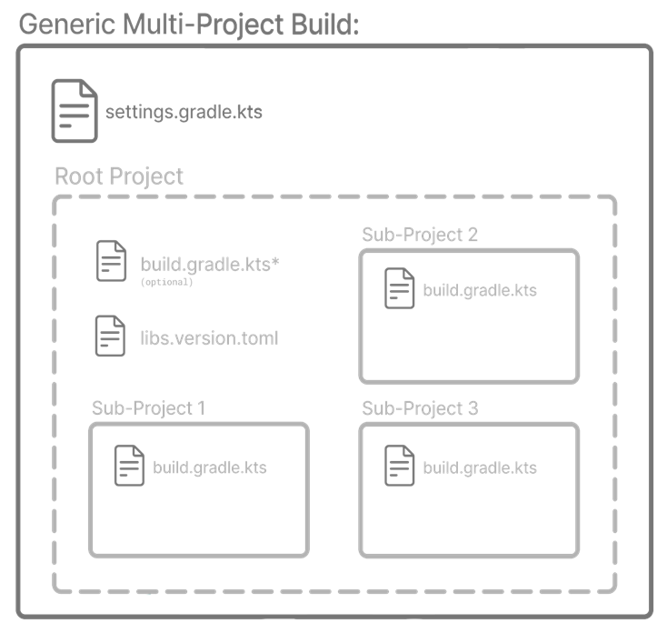
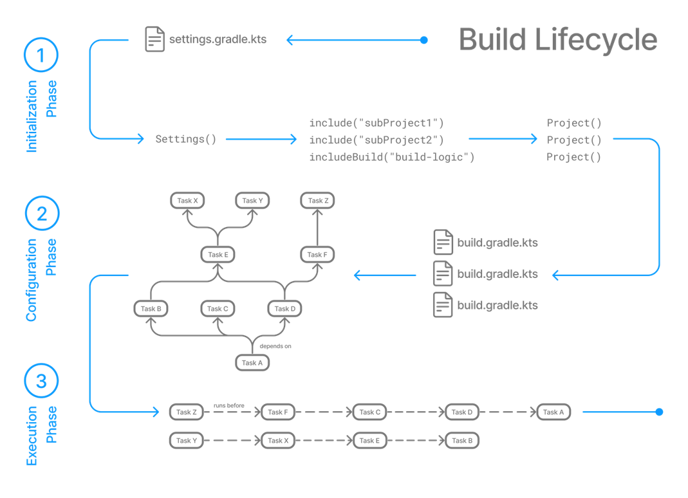

# Atlas - Gradle

<!-- toc -->

- [atlas Gradle multi module project](#atlas-gradle-multi-module-project)
  * [Sharing build logic with convention plugin](#sharing-build-logic-with-convention-plugin)
- [Useful gradle commands](#useful-gradle-commands)
- [Gradle Concepts in a Nutshell](#gradle-concepts-in-a-nutshell)
  * [Build Lifecycle](#build-lifecycle)
  * [Gradle Cache](#gradle-cache)
  * [Incremental Build](#incremental-build)
  * [Gradle Daemon](#gradle-daemon)
  * [Build Scan](#build-scan)
  * [Gradle wrapper](#gradle-wrapper)
  * [Dependency Management](#dependency-management)
    + [Implementation vs api](#implementation-vs-api)
    + [Best Practices for Gradle Dependency Management](#best-practices-for-gradle-dependency-management)
- [How to increase your Gradle Build Speed](#how-to-increase-your-gradle-build-speed)
  * [IntelliJ runner](#intellij-runner)
  * [Enable Gradle Offline Mode](#enable-gradle-offline-mode)
  * [Add GRADLE_OPTS env](#add-gradle_opts-env)
  * [Configuration Cache](#configuration-cache)
- [Troubleshooting](#troubleshooting)
  * [Parallel Execution](#parallel-execution)
- [Useful links](#useful-links)

<!-- tocstop -->

atlas uses [Gradle](https://gradle.org/) as a **Build Automation Tool**.

## atlas Gradle multi module project



1. [settings.gradle.kts](../settings.gradle.kts)
   see [Gradle Settings script](https://docs.gradle.org/current/userguide/settings_file_basics.html#sec:settings_file_script)
1. [build.gradle.kts](../build.gradle.kts): defines a part of the common build configuration shared between the subprojects
1. [gradle.properties](../gradle.properties):
   see [Gradle Configuration Properties](https://docs.gradle.org/current/userguide/build_environment.html#sec:gradle_configuration_properties)

### Sharing build logic with convention plugin

The project [buildSrc](../buildSrc) defines two plugins:

1. [buildlogic.java-conventions](../buildSrc/src/main/kotlin/buildlogic.java-conventions.gradle.kts): util to
   share some java, dependencies and publication logic.
2. [buildlogic.java-restdoc](../buildSrc/src/main/kotlin/buildlogic.java-restdoc.gradle.kts): add the RestDoc
   configuration logic when applied to a project.

These are normal gradle plugins that can be applied to subprojects:

```kotlin
plugins {
    id("buildlogic.java-conventions")
    id("buildlogic.java-restdoc")
}
```

For more information,
see [Sharing build logic with convention plugin](https://docs.gradle.org/current/samples/sample_convention_plugins.html):

## Useful gradle commands

| Task                                                                             | Example                                                                          |                                                                                                                                                                                                                                                                         |                                  
|----------------------------------------------------------------------------------|----------------------------------------------------------------------------------|-------------------------------------------------------------------------------------------------------------------------------------------------------------------------------------------------------------------------------------------------------------------------|
| ```./gradlew tasks```                                                            |                                                                                  | List all available tasks                                                                                                                                                                                                                                                |
| ```./gradlew build``` or ```./gradlew :{subproject}:build```                     | ```./gradlew build``` or ```./gradlew :business-organisation:build```            | Build the entire project                                                                                                                                                                                                                                                |
| ```./gradlew clean``` or ```./gradlew :{subproject}:clean```                     | ```./gradlew clean``` or ```./gradlew :workflow:clean```                         | Delete build directories                                                                                                                                                                                                                                                |
| ```./gradlew build --parallel```                                                 |                                                                                  | Build the entire project parallel                                                                                                                                                                                                                                       |
| ```./gradlew build -x {taskname}```                                              | ```./gradlew build -x test```                                                    | Build execution without test task                                                                                                                                                                                                                                       |
| ```./gradlew :{subproject}:{taskname}```                                         | ```./gradlew :location:check```                                                  | Build sub Module                                                                                                                                                                                                                                                        |
| ```./gradlew :{subproject}:{taskname} --configure-on-demand```                   | ```./gradlew :location:check --configure-on-demand```                            | Configuration-on-demand attempts to configure only the relevant projects for the requested tasks, i.e., it only evaluates the build script file of projects participating in the build. This way, the configuration time of a large multi-project build can be reduced. |
| ```./gradlew :{subprject}:bootRun --args='--spring.profiles.active={profile}'``` | ```./gradlew  :line-directory:bootRun --args='--spring.profiles.active=local'``` | Run SpringBoot application                                                                                                                                                                                                                                              |
| ```./gradlew build --no-configuration-cache -PgenerateAsciidoc=true```           |                                                                                  | Enable AsciiDoc generation (as default is not enabled due the cache-configuration compatibility)                                                                                                                                                                        |
| ```./gradlew projects```                                                         |                                                                                  | Running the projects task gives you a list of the subprojects of the selected project, displayed in a hierarchy                                                                                                                                                         |
| ```./gradlew buildEnvironment```                                                 |                                                                                  | Visualises the buildscript dependencies of the selected project                                                                                                                                                                                                         |
| ```./gradlew properties``` or ```./gradlew  :{subproject}:properties```          | ```./gradlew  properties``` or ```./gradlew  :location:properties```             | Gives you a list of the properties of the selected project                                                                                                                                                                                                              |

For more information, see [Gradle CLI](https://docs.gradle.org/current/userguide/command_line_interface.html).

## Gradle Concepts in a Nutshell

### Build Lifecycle

Gradle has 3 major phases, see [Build Lifecycle](https://docs.gradle.org/current/userguide/build_lifecycle.html) for more details:

1. **Initialization**: Builds a graphical representation of tasks (chunks of work) for each project.
    1. Detects the settings.gradle(.kts) file.
    2. Creates a Settings instance.
    3. Evaluates the settings file to determine which projects (and included builds) make up the build.
    4. Creates a Project instance for every project.
2. **Configuration**: Downloads dependencies, applies plugins, and creates model representations of each modules’ task set. This
   produces a graph of tasks for phase 3 to consume.
    1. Evaluates the build scripts, build.gradle(.kts), of every project participating in the build.
    2. Creates a task graph for requested tasks.
3. **Execution**: Runs the subset of tasks based on the input from the graph built in phase 2.
    1. Schedules and executes the selected tasks.
    2. Dependencies between tasks determine execution order.
    3. Execution of tasks can occur in parallel.



### Gradle Cache

To improve the performance, Gradle offers multiple cache features:

1. [Build Cache](https://docs.gradle.org/current/userguide/build_cache.html): caches the output result on certain tasks execution
2. [Configuration cache](https://docs.gradle.org/current/userguide/configuration_cache.html): caches the project configuration
3. [Parallel configuration caching](https://docs.gradle.org/current/userguide/configuration_cache.html#config_cache:usage:parallel):
   the configuration cache is parallel generated
4. [Configuration On Demand](https://docs.gradle.org/current/userguide/multi_project_configuration_and_execution.html):
   attempts to configure only the relevant projects for the requested tasks, i.e., it only evaluates the
   build script file of projects participating in the build. **Note** usefully only local.

When you run a task and the task is marked with **FROM-CACHE** in the console output, this means build cache is at work.

### Incremental Build

The incremental build is a build that avoids running tasks whose inputs did not change since the previous build, making the
execution of such tasks unnecessary.

When you run a task and the task is marked with **UP-TO-DATE** in the console output, this means incremental build is at work.

### Gradle Daemon

The Gradle Daemon is a long-lived background process that reduces the time it takes to run a build, see
[Gradle Daemon Official Documentation](https://docs.gradle.org/current/userguide/gradle_daemon.html):

1. Caching project information across builds
2. Running in the background so every Gradle build doesn’t have to wait for JVM startup
3. Benefiting from continuous runtime optimization in the JVM
4. Watching the file system to calculate exactly what needs to be rebuilt before you run a build

:warning: The Daemon enables faster builds, which is particularly important when a human is sitting in front of the build. For CI
builds, stability and predictability is of utmost importance. Using a fresh runtime (i.e. process) for each build is more reliable
as the runtime is completely isolated from previous builds.

### Build Scan

Build scans are a persistent, shareable record of what happened when running a build. Build scans provide insights into your build
that you can use to identify and fix performance bottleneck. The command ```./gradlew build scan``` run a build scan.
For more information, see [Build Scans official documentation](https://docs.gradle.org/current/userguide/build_scans.html)

### Gradle wrapper

The Gradle wrapper is a script you add to your Gradle project and use to execute your build. The advantages are:

1. no needs to have Gradle installed on your machine to build the project
2. the wrapper guarantees you’ll be using the version of Gradle required by the project
3. you can easily update the project to a newer version of Gradle, and push those changes to version control so other team
   members use the newer version

### Dependency Management

Gradle documentation:
1. [Dependency Management](https://docs.gradle.org/current/userguide/getting_started_dep_man.html#dependency-management-in-gradle)
2. [Dependency Management Basics](https://docs.gradle.org/current/userguide/dependency_management_basics.html)

#### Implementation vs api

**The main difference between implementation and api in Gradle is that implementation doesn’t transitively export the dependency
to other modules that depend on this module. In contrast, api transitively exports the dependency to other modules.**

:warning: **We should use the api configuration with caution because it increases the build time significantly over the
implementation configuration.** As an example, if an api dependency changes its external API, Gradle recompiles all modules that
have access to that dependency, even at compile time. In contrast, if an implementation dependency changes its external API,
Gradle doesn’t recompile all modules even when the software in the modules is not running because the dependent modules don’t
have access to that dependency at compile time.

#### Best Practices for Gradle Dependency Management

To ensure effective dependency management in Gradle, we should consider a few best practices:

1. Use the **implementation** configuration by default
2. Use the **compileOnly** configuration when you don’t want to package the dependency in the build output. An example use case is a
   software library that only includes compile-time annotations, which are typically used to generate code but are not needed at
   runtime
3. Avoid using the **api** configuration, as it can lead to longer build times and increased memory usage
4. Use specific versions of dependencies instead of dynamic versioning to ensure consistent behavior across builds
5. Keep the dependency graph as small as possible to reduce complexity and improve build times
6. Regularly check for updates to dependencies and update them as necessary to ensure that the project uses the latest and most
   secure versions
7. Use dependency locking to ensure that builds are reproducible and consistent across different machines and environments

## How to increase your Gradle Build Speed

### IntelliJ runner

To start a SpringBoot App and to get the full benefit of Gradle, we need to use the Gradle Runner instead of the SpringBoot Runner.
The atlas Gradle runners are stored in **.idea/runConfigurations**.

### Enable Gradle Offline Mode

Enable Gradle Offline Work from **Preferences-> Build, Execution, Deployment-> Build Tools-> Gradle**. This will not allow the
Gradle
to access the network during build and force it to resolve the dependencies from the cache itself. _**Note**: This only works if
all
the dependencies are downloaded and stored in the cache once. If you need to modify or add a new dependency, you’ll have to
disable
this option else the build would fail._

### Add GRADLE_OPTS env

Add **GRADLE_OPTS=-Xmx2048m** to your environment variables.

### Configuration Cache

"_The configuration cache is a feature that significantly improves build performance by caching the result of the
configuration phase and reusing this for subsequent builds. Using the configuration cache, Gradle can skip the configuration
phase entirely when nothing that affects the build configuration, such as build scripts, has changed. Gradle also applies
performance improvements to task execution as well._" See
[Official Gradle Configuration cache documentation](https://docs.gradle.org/current/userguide/configuration_cache.html).

:warning: Unfortunately, at the moment, this feature cannot be used with the RestDoc generation task due to incompatibility with
the asciidoctor plugin (see [GitHub issue](https://github.com/asciidoctor/asciidoctor-gradle-plugin/pull/730)).

To get the benefit of the Gradle configuration cache feature, we built a small workaround until the Asciidoctor plugin resolve
the issue:

1. As default the **configuration cache is enabled** and the **Asciidoctor generation is disabled**, by executing ```.
/gradlew build``` no RestDoc will be generated.
2. If you want to generate on your local machine the RestDoc, you have to execute the following command: ```./gradlew build --no-configuration-cache 
   -PgenerateAsciidoc=true```.
3. On Tekton the RestDoc generation is only enabled on the release Job

## Troubleshooting

### Parallel Execution

With Gradle is possible to build a project
with [parallel execution](https://docs.gradle.org/current/userguide/performance.html#parallel_execution) mode.

_atlas_ is built by Gradle in **parallel execution mode** with the additional parameter ```--parallel```.

The **parallel execution mode** is a heavy process that can overload your machine and is not enabled locally.
If your machine is fit just run a gradle task with ```--parallel```, e.g:

```shell
./gradlew build --parallel
```

## Useful links

1. [Run Custom Gradle Task After “build](https://handstandsam.com/2021/06/07/run-custom-gradle-task-after-build/)
2. [Gradle Cache: Your build’s best friend](https://proandroiddev.com/gradle-cache-your-builds-best-friend-4970ad32420e)
3. [Improve the Performance of Gradle Builds](https://docs.gradle.org/current/userguide/performance.html)