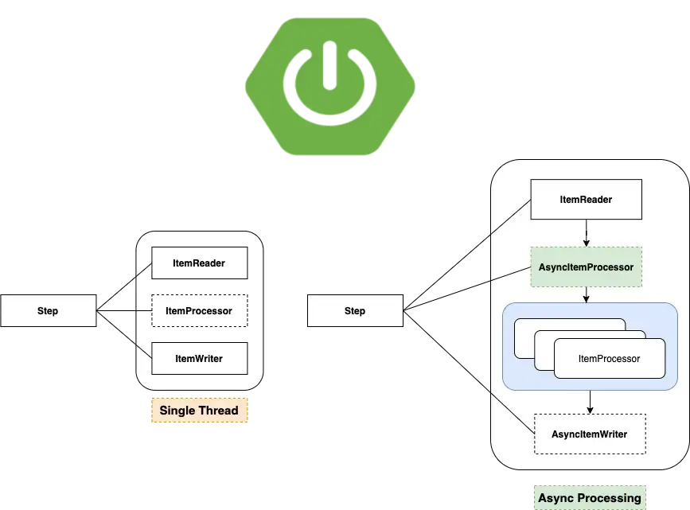

# Import Service Point

<!-- toc -->

- [ATLAS](#atlas)
- [Project Versioning](#project-versioning)
- [Links](#links)
    * [Localhost](#localhost)
    * [Development](#development)
    * [Test](#test)
    * [Integration](#integration)
    * [Production](#production)
    * [Project Infrastructure](#project-infrastructure)
- [Development](#development-1)
    * [Spring Batch](#spring-batch)
    * [Tech Stack](#tech-stack)

<!-- tocstop -->

The main goal of the Atlas Import Service Point is to import Didok Service Point Directory Data from a CSV file uploaded on the
Amazon S3 Bucket to the Service Point Directory service.

See [ADR-0015](https://confluence.sbb.ch/display/ATLAS/ADR-0015%3A++Service+Point+Directory+Import)

## ATLAS

This application is part of ATLAS. General documentation is
available [here](https://code.sbb.ch/projects/KI_ATLAS/repos/atlas-backend/browse/README.md#big-picture)
.

## Project Versioning

This project uses [Semantic Versioning](https://semver.org/).

## Links

### Localhost

* Openshift Project: https://console-openshift-console.apps.aws01t.sbb-aws-test.net/k8s/cluster/projects/atlas-dev
* Project deploy: https://scheduling.dev.sbb-cloud.net

### Development

* DB AWS PostgreSQL: https://ssp.dbms.sbb.ch/manageinstanceaws?i=import-dev
* Openshift Project: https://console-openshift-console.apps.aws01t.sbb-aws-test.net/k8s/cluster/projects/atlas-dev
* Project deploy: https://scheduling.dev.sbb-cloud.net

### Test

* DB AWS PostgreSQL: https://ssp.dbms.sbb.ch/manageinstanceaws?i=import-test
* Openshift Project: https://console-openshift-console.apps.aws01t.sbb-aws-test.net/k8s/cluster/projects/atlas-test
* Project deploy: https://scheduling.test.sbb-cloud.net

### Integration

* DB AWS PostgreSQL: https://ssp.dbms.sbb.ch/manageinstanceaws?i=import-int
* Openshift Project: https://console-openshift-console.apps.maggie.sbb-aws.net/k8s/cluster/projects/atlas-int
* Project deploy: https://scheduling.int.sbb-cloud.net

### Production

* DB AWS PostgreSQL: https://ssp.dbms.sbb.ch/manageinstanceaws?i=import-prod
* Openshift
  Project: https://console-openshift-console.apps.maggie.sbb-aws.net/k8s/cluster/projects/atlas-prod

### Project Infrastructure

* Jenkins: https://ci.sbb.ch/job/KI_ATLAS/job/atlas/
* Sonarqube: https://codequality.sbb.ch/dashboard?id=ch.sbb.atlas%3Aatlas&branch=master
* JFrog / Artifactory
    * Maven repository: https://bin.sbb.ch/ui/repos/tree/General/atlas.mvn
    * Docker registry: https://bin.sbb.ch/ui/repos/tree/General/atlas.docker
* Infrastructure
  documentation: https://confluence.sbb.ch/display/ATLAS/%5BATLAS%5D+7.1.+Infrastruktur+Ebene+1

## Development

### Spring Batch

We use [Spring Batch Jobs](https://docs.spring.io/spring-batch/docs/current/reference/html/) to import CSV file from
[ATLAS Amazon S3 Bucket](../../atlas/base-service/documentaion/amazon/README.md).

As the size of the CSV files could be huge we
use [Async Chunk Steps](https://docs.spring.io/spring-batch/docs/current/reference/html/scalability.html#scalability) inside the
Job to scale the import process.

### Tech Stack

See [Tech Stack Documentation](../documentation/tech-stack-service.md)