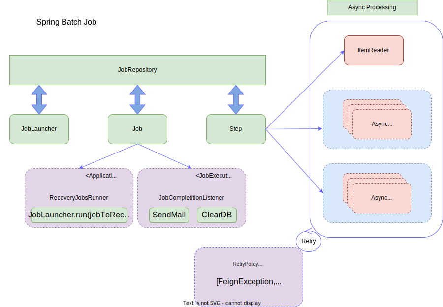

# Import Service Point

<!-- toc -->

- [ATLAS](#atlas)
- [Project Versioning](#project-versioning)
- [Links](#links)
    * [Localhost](#localhost)
    * [Development](#development)
    * [Test](#test)
    * [Integration](#integration)
    * [Production](#production)
    * [Project Infrastructure](#project-infrastructure)
- [Big Picture Architecture](#big-picture-architecture)
- [Development](#development-1)
    * [Spring Batch](#spring-batch)
- [Jobs](#jobs)
    * [Import ServicePoint](#import-servicepoint)
    * [Import TrafficPoint](#import-trafficpoint)
    * [Import LoadingPoint](#import-loadingpoint)
    * [Import Service API calls](#import-service-api-calls)
    * [Tech Stack](#tech-stack)

<!-- tocstop -->

The main goal of the Atlas Import Service Point is to import Didok Service Point Directory Data from a CSV file uploaded on the
Amazon S3 Bucket to the Service Point Directory service.

See [ADR-0015](https://confluence.sbb.ch/display/ATLAS/ADR-0015%3A++Service+Point+Directory+Import)

## ATLAS

This application is part of ATLAS. General documentation is
available [here](https://code.sbb.ch/projects/KI_ATLAS/repos/atlas/browse/README.md)
.

## Project Versioning

This project uses [Semantic Versioning](https://semver.org/).

## Links

### Localhost

* Openshift Project: https://console-openshift-console.apps.aws01t.sbb-aws-test.net/k8s/cluster/projects/atlas-dev
* Project deploy: https://import-service-point-int.dev.sbb-cloud.net

### Development

* DB AWS PostgreSQL: https://ssp.dbms.sbb.ch/manageinstanceaws?i=import-service-point-dev
* Openshift Project: https://console-openshift-console.apps.aws01t.sbb-aws-test.net/k8s/cluster/projects/atlas-dev
* Project deploy: https://import-service-point-int.dev.sbb-cloud.net

### Test

* DB AWS PostgreSQL: https://ssp.dbms.sbb.ch/manageinstanceaws?i=import-service-point-test
* Openshift Project: https://console-openshift-console.apps.aws01t.sbb-aws-test.net/k8s/cluster/projects/atlas-test
* Project deploy: https://import-service-point-int.test.sbb-cloud.net

### Integration

* DB AWS PostgreSQL: https://ssp.dbms.sbb.ch/manageinstanceaws?i=import-service-point-int
* Openshift Project: https://console-openshift-console.apps.maggie.sbb-aws.net/k8s/cluster/projects/atlas-int
* Project deploy: https://import-service-point-int.int.sbb-cloud.net

### Production

* DB AWS PostgreSQL: https://ssp.dbms.sbb.ch/manageinstanceaws?i=import-service-point-prod
* Openshift
  Project: https://console-openshift-console.apps.maggie.sbb-aws.net/k8s/cluster/projects/atlas-prod

### Project Infrastructure

* Tekton : https://tekton-control-panel-atlas-tekton.sbb-cloud.net/projects/KI_ATLAS/repositories/atlas
* Sonarqube: https://codequality.sbb.ch/dashboard?id=ch.sbb.atlas%3Aatlas&branch=master
* JFrog / Artifactory
    * Maven repository: https://bin.sbb.ch/ui/repos/tree/General/atlas.mvn
    * Docker registry: https://bin.sbb.ch/ui/repos/tree/General/atlas.docker
* Infrastructure
  documentation: https://confluence.sbb.ch/display/ATLAS/%5BATLAS%5D+7.1.+Infrastruktur+Ebene+1

## Big Picture Architecture

## Development

### Spring Batch

We use [Spring Batch Jobs](https://docs.spring.io/spring-batch/docs/current/reference/html/) to import CSV file from
[ATLAS Amazon S3 Bucket](../base-atlas/documentation/amazon/README.md).

Since CSV file sizes can be very large, we
use [Async Chunk Steps](https://docs.spring.io/spring-batch/docs/current/reference/html/scalability.html#scalability) within the
Job to scale the import process.

## Jobs

### Import ServicePoint

The import ServicePoint Job is responsible to:

* download, parse and group by didok number the **DINSTSTELLEN_V3_IMPORT_{date_time}.csv** from the Amazon S3 Bucket
* send over HTTP chunks with lists of ServicePoints grouped by didok number (multithreading)
* a retry system is configured on the step level when certain exception are thrown
  (see [StepUtils.java](src/main/java/ch/sbb/importservice/utils/StepUtils.java))
* the [RecoveryJobsRunner.java](src/main/java/ch/sbb/importservice/recovery/RecoveryJobsRunner.java) checks at startup if
  there are jobs not completed. When an uncompleted job is found, it will be restarted
* After a job has been completed (successfully or unsuccessfully) an email notification is sent to TechSupport-ATLAS@sbb.ch

### Import TrafficPoint

The import TrafficPoint Job is responsible to:

* download, parse and group by didok number the **VERKEHRSPUNKTELEMENTE_ALL_V1_{date_time}.csv** from the Amazon S3 Bucket
* send over HTTP chunks with lists of TrafficPoints grouped by didok number (multithreading)
* a retry system is configured on the step level when certain exception are thrown
  (see [StepUtils.java](src/main/java/ch/sbb/importservice/utils/StepUtils.java))
* the [RecoveryJobsRunner.java](src/main/java/ch/sbb/importservice/recovery/RecoveryJobsRunner.java) checks at startup if
  there are jobs not completed. When an uncompleted job is found, it will be restarted
* After a job has been completed (successfully or unsuccessfully) an email notification is sent to TechSupport-ATLAS@sbb.ch

### Import LoadingPoint

The import LoadingPoint Job is responsible to:

* download, parse and group by didok number the **DIDOK3_LADESTELLEN_{date_time}.csv** from the Amazon S3 Bucket
* send over HTTP chunks with lists of LoadingPoints grouped by didok number (multithreading)
* a retry system is configured on the step level when certain exception are thrown
  (see [StepUtils.java](src/main/java/ch/sbb/importservice/utils/StepUtils.java))
* the [RecoveryJobsRunner.java](src/main/java/ch/sbb/importservice/recovery/RecoveryJobsRunner.java) checks at startup if
  there are jobs not completed. When an uncompleted job is found, it will be restarted
* After a job has been completed (successfully or unsuccessfully) an email notification is sent to TechSupport-ATLAS@sbb.ch

### Import Service API calls

See [ImportServicePointBatchControllerApiV1.java](src/main/java/ch/sbb/importservice/controller/ImportServicePointBatchController.java)

### Tech Stack

See [Tech Stack Documentation](../documentation/tech-stack-service.md)

### Reset Batch

See [Batch Reset](../documentation/batch_util.md)
