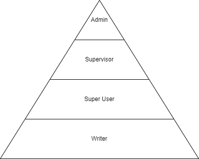

# Implementation of UserAdministration for business services

<!-- toc -->

- [Specification and Overview](#specification-and-overview)
- [Usage](#usage)

<!-- tocstop -->

## Specification and Overview
Based on Specification: https://confluence.sbb.ch/pages/viewpage.action?pageId=2118124295



As illustrated in the diagram, every role has the priviledges of the role below.

Everyone may:
- Read business objects on the atlas platform.

The writer additionally may:
- Create and update business objects, belonging to a business organisation he manages

The super user additionally may:
- Create and update business objects, belonging to any business organisation

The supervisor additionally may:
- Interfere with workflow steps

The admin additionally may:
- See and manage users for the atlas platform

## Usage

```xml
<dependency>
  <groupId>ch.sbb.atlas</groupId>
  <artifactId>user-administration-security</artifactId>
  <version>${revision}</version>
</dependency>
```
Define the user administration topic.
```yaml
  kafka:
      user:
        administration:
          topic: atlas.dev.user.administration
          groupId: atlas.kafka.user
```

`@Import(UserAdministrationConfig.class)` to include the config to the application context.

```java
@PreAuthorize("@businessOrganisationBasedUserAdministrationService.hasUserPermissionsToCreate(#businessObject, T(ch.sbb.atlas.kafka.model.user.admin.ApplicationType).LIDI)")
public LineVersion create(LineVersion businessObject) {
    return save(businessObject);
}
```

This snippet will call the Bean with name `userAdministrationService` and execute the `hasUserPermissionsToCreate` function. 
The parameter `businessObject` is passed along with the enum constant for the application type.
If the function returns true, the user is allowed to proceed, if it returns false, spring will return an access denied (403 - Forbidden).
